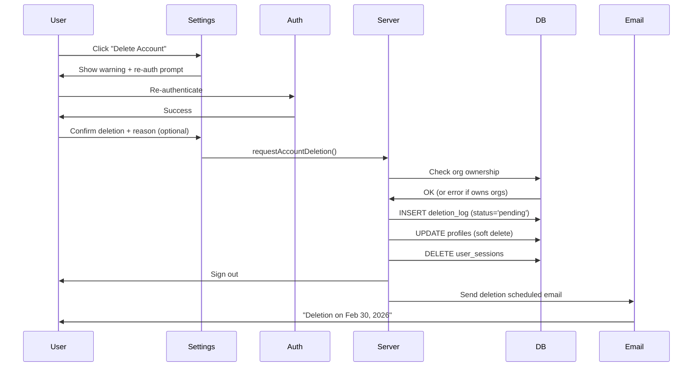
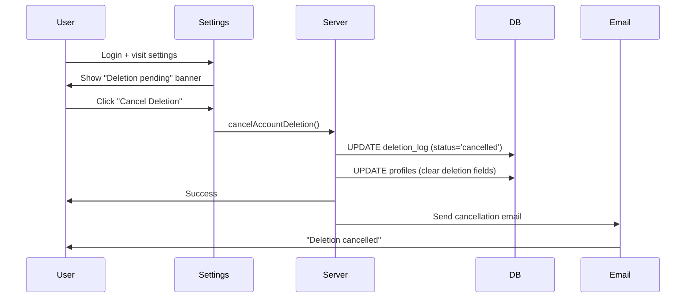
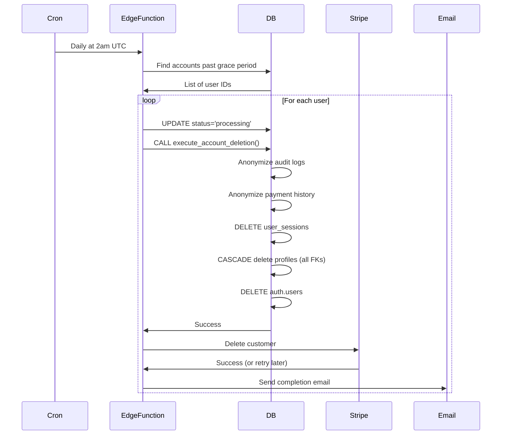

# GDPR Article 17: Account Deletion Architecture

**Status:** Ready for Implementation
**Date:** 2026-01-31
**Compliance:** GDPR Article 17 (Right to Erasure)

---

## Table of Contents

1. [Overview](#overview)
2. [User Flow](#user-flow)
3. [Technical Architecture](#technical-architecture)
4. [Database Schema](#database-schema)
5. [API Reference](#api-reference)
6. [Deployment Guide](#deployment-guide)
7. [Testing Checklist](#testing-checklist)
8. [Monitoring & Alerts](#monitoring--alerts)
9. [Compliance Notes](#compliance-notes)

---

## Overview

### Requirements Met

- [x] User-initiated deletion from settings page
- [x] 30-day grace period (soft delete)
- [x] Audit log anonymization (not deletion)
- [x] Cascade delete all user data
- [x] Stripe customer deletion
- [x] Email notifications (scheduled, reminder, complete)
- [x] Cancellation during grace period
- [x] Re-authentication required

### Architecture Principles

1. **Correctness First**: Deletion is atomic and transactional
2. **Data Retention Compliance**: 7-year payment history, anonymized audit logs
3. **Grace Period**: 30 days to change mind
4. **Idempotency**: Safe to retry failed deletions
5. **Eventual Consistency**: Stripe deletion may fail, retries async

---

## User Flow

### 1. Request Deletion



**Duration:** 30 days until permanent deletion

### 2. Cancel Deletion (During Grace Period)



### 3. Permanent Deletion (After 30 Days)



---

## Technical Architecture

### Components

1. **Server Actions** (`src/lib/account/deletion-actions.ts`)
   - `requestAccountDeletion(reason?)` - Soft delete
   - `cancelAccountDeletion()` - Restore account
   - `getAccountDeletionStatus()` - Check pending deletion
   - `getAllDeletionRequests(status?)` - Admin monitoring

2. **Edge Function** (`supabase/functions/process-account-deletions`)
   - Runs daily via cron (2am UTC)
   - Processes scheduled deletions
   - Retries failed Stripe deletions
   - Sends reminder emails (7 days before)

3. **Database Functions** (Postgres)
   - `execute_account_deletion(user_id)` - Master deletion
   - `anonymize_audit_logs(user_id)` - Remove PII from logs
   - `anonymize_payment_history(user_id, stripe_customer_id)` - Remove PII from payments
   - `delete_user_sessions(user_id)` - Invalidate sessions

4. **Email Notifications**
   - Initial: "Deletion scheduled for [date]"
   - Reminder: "7 days remaining to cancel"
   - Completion: "Account deleted"
   - Cancellation: "Deletion cancelled"

### Data Flow

```
User Request → Server Action → Database (Soft Delete) → Email
                                    ↓
                              Grace Period (30 days)
                                    ↓
Edge Function → Database (Hard Delete) → Stripe API → Email
```

---

## Database Schema

### New Tables

#### `account_deletion_log`

Tracks lifecycle of deletion requests for GDPR compliance.

| Column | Type | Description |
|--------|------|-------------|
| `id` | UUID | Primary key |
| `user_id` | UUID | User being deleted (NOT FK) |
| `profile_email` | TEXT | Denormalized for post-deletion reference |
| `requested_at` | TIMESTAMPTZ | When user requested deletion |
| `scheduled_for` | TIMESTAMPTZ | When deletion will execute (30 days) |
| `cancelled_at` | TIMESTAMPTZ | When user cancelled |
| `completed_at` | TIMESTAMPTZ | When deletion completed |
| `status` | TEXT | 'pending', 'cancelled', 'processing', 'completed', 'failed' |
| `deletion_reason` | TEXT | Optional user-provided reason |
| `stripe_customer_id` | TEXT | For Stripe cleanup |
| `stripe_deleted` | BOOLEAN | Whether Stripe deletion succeeded |
| `initial_notification_sent` | BOOLEAN | Email tracking |
| `reminder_7day_sent` | BOOLEAN | Email tracking |
| `completion_notification_sent` | BOOLEAN | Email tracking |

### Modified Tables

#### `profiles`

Added soft delete columns:

| Column | Type | Description |
|--------|------|-------------|
| `deletion_requested_at` | TIMESTAMPTZ | When deletion requested |
| `deletion_scheduled_for` | TIMESTAMPTZ | When deletion will occur |
| `deleted_at` | TIMESTAMPTZ | When deletion completed |
| `deletion_reason` | TEXT | User-provided reason |
| `deletion_ip_address` | TEXT | Audit trail |
| `deletion_user_agent` | TEXT | Audit trail |

### Indexes

```sql
-- Efficient cleanup queries (partial index)
CREATE INDEX idx_profiles_deletion_scheduled
ON profiles(deletion_scheduled_for)
WHERE deletion_scheduled_for IS NOT NULL AND deleted_at IS NULL;

-- Audit queries
CREATE INDEX idx_profiles_deleted_at
ON profiles(deleted_at)
WHERE deleted_at IS NOT NULL;

-- Deletion log queries
CREATE INDEX idx_deletion_log_status ON account_deletion_log(status);
CREATE INDEX idx_deletion_log_scheduled ON account_deletion_log(scheduled_for)
WHERE status = 'pending';
```

---

## API Reference

### Server Actions

#### `requestAccountDeletion(reason?: string)`

**Authentication:** Required (re-auth recommended)

**Preconditions:**
- User must not own any organizations (must transfer first)
- No existing deletion request

**Returns:**
```typescript
{
  success: boolean;
  scheduledFor?: string; // ISO 8601 timestamp
  error?: string;
}
```

**Side Effects:**
- Inserts row in `account_deletion_log`
- Updates `profiles` with deletion timestamps
- Deletes all `user_sessions` (force logout)
- Sends email notification

#### `cancelAccountDeletion()`

**Authentication:** Required

**Preconditions:**
- Deletion request exists
- Grace period not expired

**Returns:**
```typescript
{
  success: boolean;
  error?: string;
}
```

**Side Effects:**
- Updates `account_deletion_log` (status='cancelled')
- Clears deletion fields from `profiles`
- Sends cancellation email

#### `getAccountDeletionStatus()`

**Authentication:** Required

**Returns:**
```typescript
{
  hasPendingDeletion: boolean;
  deletionRequest?: AccountDeletionRequest;
  daysRemaining?: number;
}
```

---

## Deployment Guide

### Step 1: Run Migration

```bash
# Supabase CLI
supabase db push

# Or manually apply migration
psql $DATABASE_URL -f supabase/migrations/20260131_account_deletion_gdpr.sql
```

**Verification:**
```sql
-- Check tables exist
\dt account_deletion_log
\d profiles

-- Check functions exist
\df execute_account_deletion
\df anonymize_audit_logs
```

### Step 2: Deploy Edge Function

```bash
# Deploy edge function
supabase functions deploy process-account-deletions

# Set environment variables
supabase secrets set STRIPE_SECRET_KEY=sk_live_...
supabase secrets set RESEND_API_KEY=re_...
supabase secrets set CRON_SECRET=$(openssl rand -hex 32)
```

### Step 3: Configure Cron Trigger

```bash
# Create cron job (runs daily at 2am UTC)
supabase functions schedule process-account-deletions "0 2 * * *"
```

**Verification:**
```bash
# Manually trigger to test
supabase functions invoke process-account-deletions \
  --method POST \
  --header "X-Cron-Secret: YOUR_CRON_SECRET"
```

### Step 4: Deploy Application Code

```bash
# Deploy server actions and API routes
git add .
git commit -m "Add GDPR account deletion"
git push origin main

# Vercel will auto-deploy
```

### Step 5: Enable Feature Flag (Optional)

```env
# .env.production
ENABLE_ACCOUNT_DELETION=true
```

---

## Testing Checklist

### Unit Tests

- [ ] `requestAccountDeletion()` creates deletion log
- [ ] `requestAccountDeletion()` rejects if user owns org
- [ ] `cancelAccountDeletion()` clears deletion fields
- [ ] `cancelAccountDeletion()` fails after grace period
- [ ] `execute_account_deletion()` anonymizes audit logs
- [ ] `execute_account_deletion()` anonymizes payment history
- [ ] `execute_account_deletion()` deletes user sessions

### Integration Tests

- [ ] Full deletion flow (request → wait → delete)
- [ ] Cancellation flow (request → cancel)
- [ ] Edge function processes multiple deletions
- [ ] Stripe customer deletion (success & failure)
- [ ] Email notifications sent
- [ ] Failed deletion retries

### Manual Testing

```sql
-- Create test user
INSERT INTO auth.users (id, email) VALUES
  ('test-user-id', 'test@example.com');

-- Request deletion (via UI or server action)
-- Verify deletion_log entry created
SELECT * FROM account_deletion_log WHERE user_id = 'test-user-id';

-- Manually trigger edge function (for testing)
UPDATE account_deletion_log
SET scheduled_for = NOW() - INTERVAL '1 day'
WHERE user_id = 'test-user-id';

-- Run edge function
-- Verify user deleted
SELECT * FROM profiles WHERE id = 'test-user-id'; -- Should be gone or anonymized
SELECT * FROM audit_logs WHERE user_id = '00000000-0000-0000-0000-000000000000'; -- Anonymized
```

### Compliance Testing

- [ ] Audit logs anonymized (no PII)
- [ ] Payment history anonymized but retained
- [ ] Stripe customer deleted (or retry scheduled)
- [ ] User sessions invalidated
- [ ] Cascade deletes all user data
- [ ] Organization ownership prevents deletion

---

## Monitoring & Alerts

### Metrics to Track

```typescript
// Datadog/Grafana
account_deletion.requests_total (counter)
account_deletion.requests_cancelled (counter)
account_deletion.completed (counter)
account_deletion.failed (gauge)
account_deletion.stripe_errors (counter)
account_deletion.processing_duration_seconds (histogram)
```

### Alerts

**Critical:**
- Deletion status='failed' for > 24 hours
- Edge function hasn't run in 25 hours
- Database function error rate > 5%

**Warning:**
- Stripe deletion failed for > 3 days
- Processing duration > 10 seconds
- More than 10 deletions queued

**Info:**
- Daily deletion count > 5

### SQL Queries for Monitoring

```sql
-- Find failed deletions
SELECT * FROM account_deletion_log
WHERE status = 'failed'
ORDER BY requested_at DESC;

-- Find stuck Stripe deletions
SELECT * FROM account_deletion_log
WHERE stripe_deleted = FALSE
  AND stripe_customer_id IS NOT NULL
  AND stripe_deletion_attempted_at < NOW() - INTERVAL '3 days';

-- Deletion volume (last 30 days)
SELECT
  DATE(requested_at) as date,
  status,
  COUNT(*) as count
FROM account_deletion_log
WHERE requested_at > NOW() - INTERVAL '30 days'
GROUP BY DATE(requested_at), status
ORDER BY date DESC;
```

---

## Compliance Notes

### GDPR Article 17 Requirements

- [x] **Right to erasure**: Users can request deletion
- [x] **Without undue delay**: 30-day grace period, then immediate processing
- [x] **Exceptions respected**: Payment history retained for legal obligation (7 years)
- [x] **Third-party deletion**: Stripe customer deleted
- [x] **Proof of deletion**: `account_deletion_log` table

### Data Retention

**Deleted Immediately:**
- User profile (email, name, phone, address)
- User sessions (all active sessions)
- User consents
- League memberships
- Team rosters
- Player stats (personal association, but stats remain for historical integrity)

**Anonymized (Retained):**
- Audit logs (security/legal requirement)
  - `user_id` → `00000000-0000-0000-0000-000000000000`
  - `ip_address` → NULL
  - `user_agent` → NULL
- Payment history (7-year tax requirement)
  - `stripe_customer_id` → `deleted_customer_RANDOM`
  - Amounts and dates retained

**Never Deleted:**
- Aggregated analytics (no PII)
- System logs (no PII)

### Legal Basis for Retention

**Audit Logs:** Legitimate interest (security, fraud prevention, legal defense)
**Payment History:** Legal obligation (tax law, accounting standards)

---

## Troubleshooting

### Issue: Deletion request fails with "owns organizations"

**Solution:** User must transfer organization ownership first.

```sql
-- Find owned organizations
SELECT * FROM organizations WHERE owner_user_id = 'USER_ID';

-- Transfer ownership
UPDATE organizations
SET owner_user_id = 'NEW_OWNER_ID'
WHERE id = 'ORG_ID';
```

### Issue: Stripe deletion fails

**Solution:** Edge function will retry for 7 days. If still failing:

```bash
# Manually delete in Stripe dashboard
# Then update deletion log
UPDATE account_deletion_log
SET stripe_deleted = TRUE,
    stripe_deletion_error = NULL
WHERE user_id = 'USER_ID';
```

### Issue: Edge function not running

**Solution:** Check cron trigger is configured:

```bash
supabase functions list
# Should show process-account-deletions with schedule

# Check logs
supabase functions logs process-account-deletions
```

### Issue: User can't cancel deletion

**Solution:** Check grace period hasn't expired:

```sql
SELECT deletion_scheduled_for
FROM profiles
WHERE id = 'USER_ID';

-- If past scheduled_for, cancellation is not possible
```

---

## Future Enhancements

1. **Download Personal Data** (GDPR Article 15)
   - Export all user data as JSON/CSV
   - Include stats, game history, messages

2. **Automated Stripe Cleanup**
   - Use Stripe webhooks for deletion confirmation
   - Eliminate retry logic

3. **Granular Deletion**
   - Option to delete profile but keep stats (anonymized)
   - Option to delete from specific leagues only

4. **Admin Dashboard**
   - View all deletion requests
   - Manual intervention for failed deletions
   - Analytics on deletion reasons

5. **A/B Testing**
   - Test different grace periods (7 days vs 30 days)
   - Measure cancellation rates

---

## References

- [GDPR Article 17 - Right to Erasure](https://gdpr-info.eu/art-17-gdpr/)
- [Supabase Auth Documentation](https://supabase.com/docs/guides/auth)
- [Stripe Customer Deletion API](https://stripe.com/docs/api/customers/delete)
- [Resend Email API](https://resend.com/docs)

---

**Document Version:** 1.0
**Last Updated:** 2026-01-31
**Next Review:** After first production deletion (monitor for issues)
